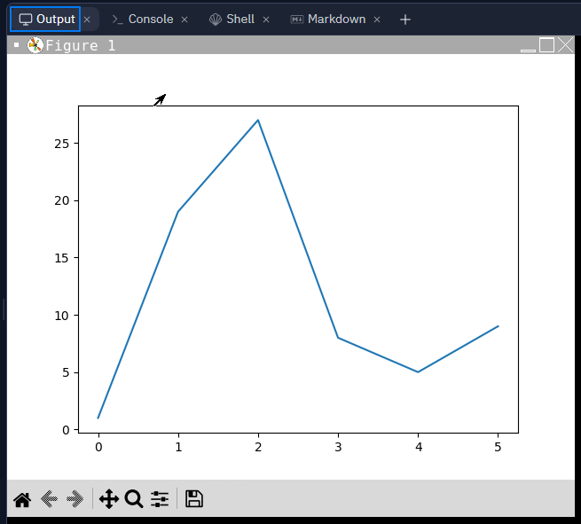

# Data Visualisation 📚

Visualisation can help us to understand large sets of data more easily. 
- We saw some visualisation earlier in 6.5 - Analysis when we were looking at skew and mode.

- It is easy to create visualisations in Python using a module called `matplotlib`.

# Plotting Graphs 📈

Try the following code using `myList` from the earlier problem sets.

````py
import matplotlib.pyplot as plt

myList = [1,19,27,8,5,9]
plt.plot(myList)
plt.show()
````

Let's take a closer look at the first line of our code above:

````py
import matplotlib.pyplot as plt
````
- This import uses a particular interface `pyplot`, from the `matplotlib` module.
- The `pyplot` interface is mainly used for interactive plots _(graphs)_ and simple plot generations, which is ideal for what we require.
- To avoid writing `matplotlib.pyplot` everytime, we can use `as plt` and assign it the short-hand `plt`.
- We can then use this to call `matplotlib.pyplot`.

Looking at the following line we can see it takes in a list as an arguement:
````py
plt.plot(myList)
````
💡 _Note: it can take more than one list, using multiple arguments._

- The `.plot()` function uses the values in `myList` as the _y-axis_ values.
- Since there are no _x-axis_ values, the `pyplot` interface uses the list index numbers _(0,1,2...etc)_ as the x-axis values.

The final line of code draws the plot:
````py
plt.show()
````
- The default output of the `.plot()` function is a line graph.
- The default colour of the line is blue.

If you typed up your code correctly, you should have an output like so...



###  👉 Please take some time to explore the functionality of the buttons beneath your plot.


